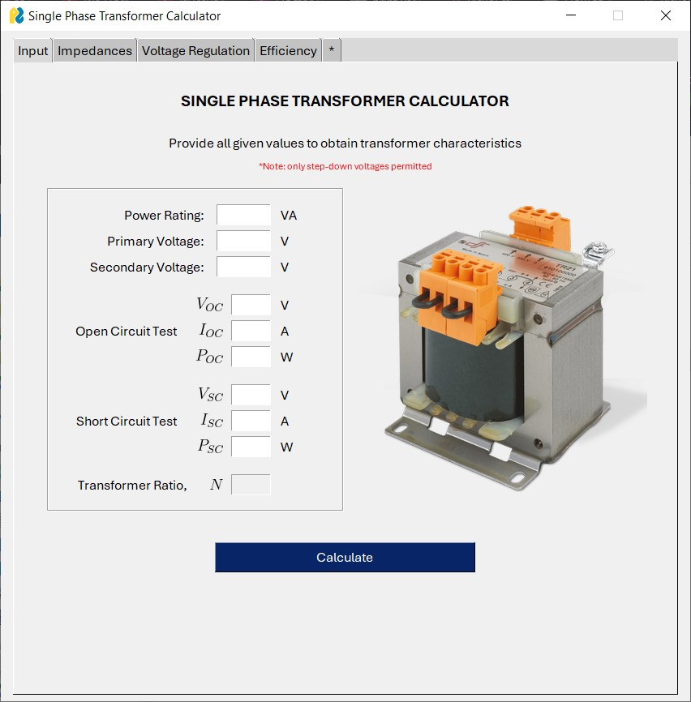
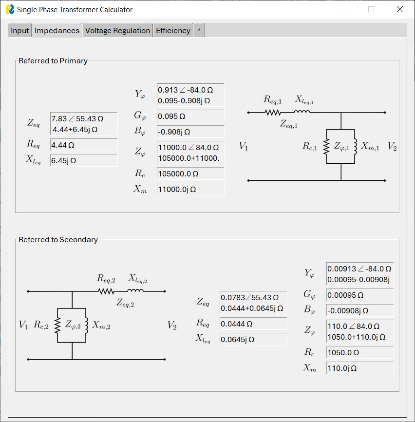
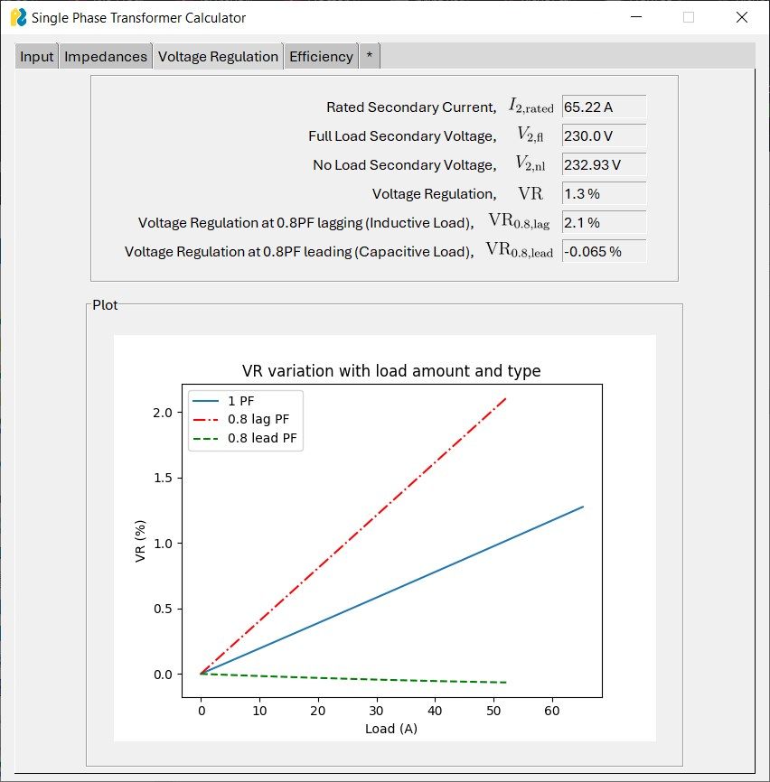
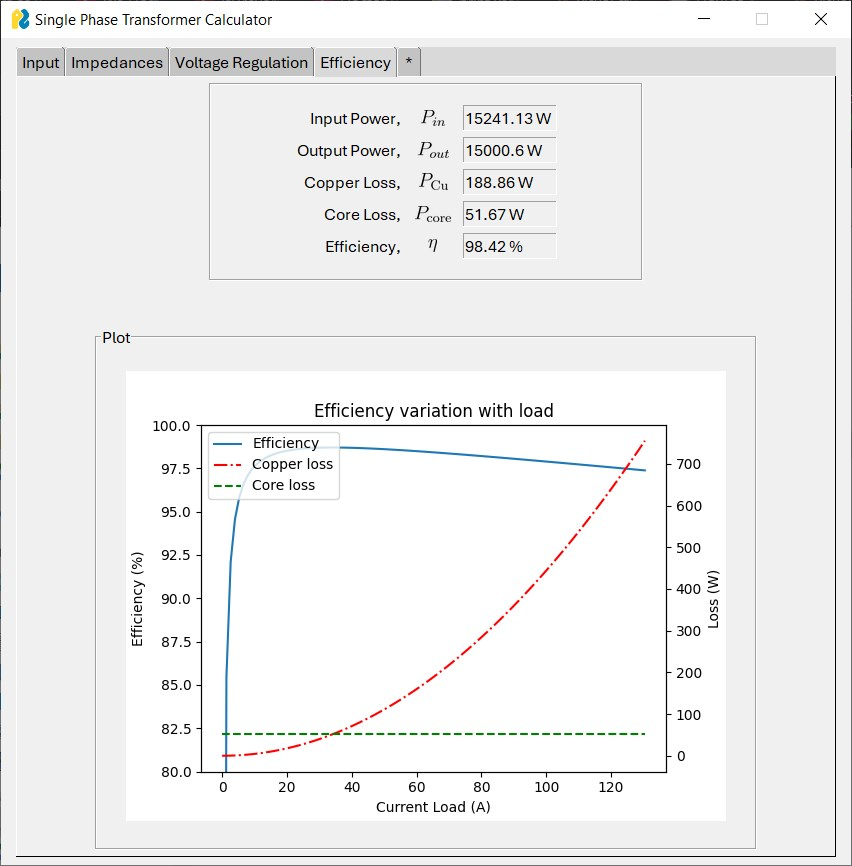

# EEE-3003: Electromechanical Energy Conversion - Project

### Single Phase Transformer Calculator

    

### Series and Parallel Impedances

    

### Voltage Regulation

    

### Efficiency and Power Losses

    

